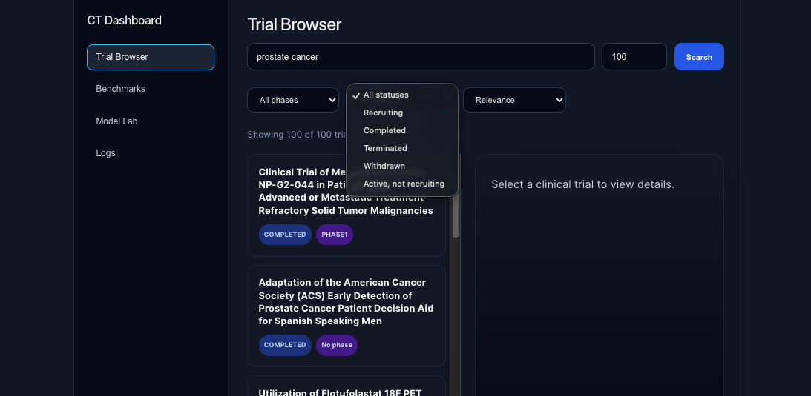
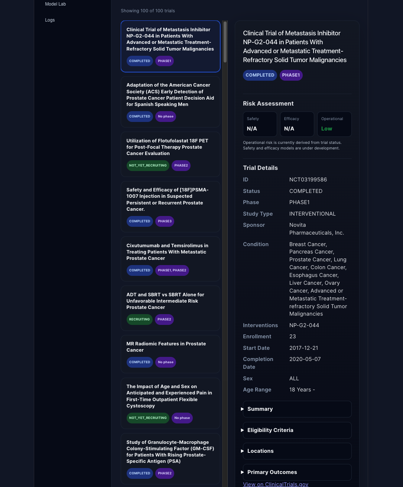
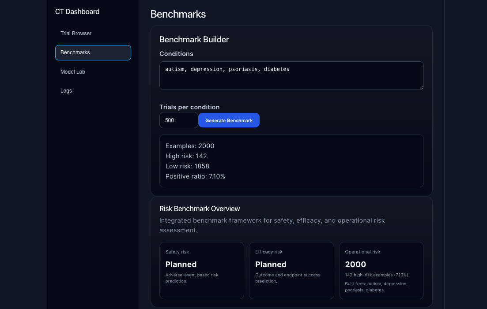
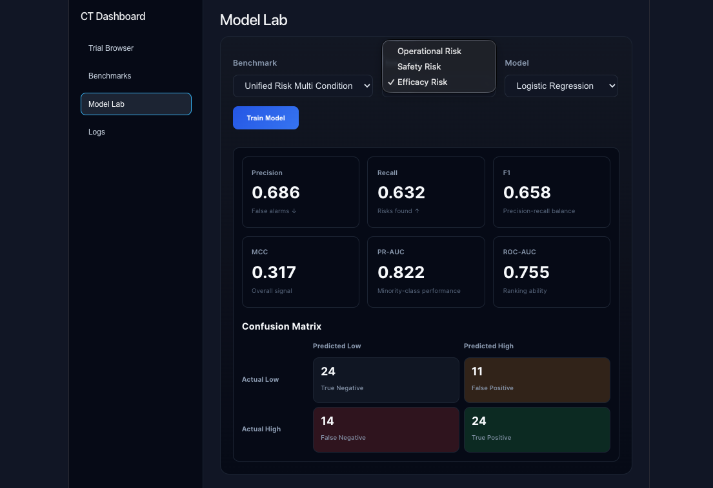
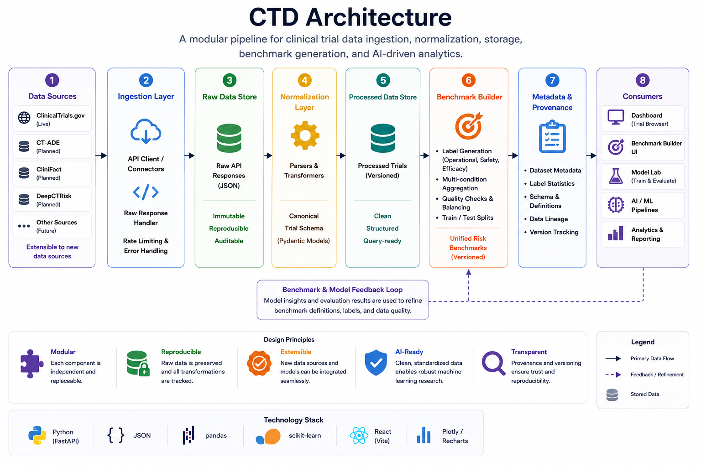

# Clinical Trial Dashboard (CTD)

A multimodal clinical trial intelligence platform for data exploration, benchmark creation, and AI-driven clinical trial risk assessment.

---

## Overview

Clinical trials are essential for developing new therapies, but they are expensive, time-consuming, and subject to high failure rates.

The Clinical Trial Dashboard (CTD) aims to improve clinical trial analysis by integrating structured trial metadata, protocol information, outcomes, adverse events, and future multimodal data sources into a unified platform.

The long-term objective is to support AI-based prediction of:

* Safety risk
* Efficacy risk
* Operational risk

using modern machine learning techniques including large language models (LLMs), graph neural networks (GNNs), and multimodal learning.

The CTD serves as both:

* An interactive dashboard for clinical trial exploration
* A benchmark-building platform for machine learning research

---

## Current Features

### Data ingestion

* Fetches trial data from ClinicalTrials.gov
* Supports condition-based search queries
* Configurable page size

### Data normalization

* Converts raw API responses into a canonical `Trial` schema
* Decouples downstream components from source-specific formats

### Data storage

* Stores raw API responses for reproducibility
* Stores normalized datasets for downstream use
* Generates metadata files describing dataset provenance

### Dataset serving

* Serves locally stored processed datasets when available
* Supports forced refresh from external sources

### Frontend dashboard

* Interactive React-based interface
* Trial filtering and exploration
* Expandable trial details
* Fast loading using processed datasets

---

## Dashboard Preview

The Clinical Trial Dashboard provides an interactive interface for
exploring clinical trial datasets, inspecting study details, and
supporting future AI-driven clinical trial analysis.

### Clinical Trial Explorer



Interactive exploration of clinical trials with filtering by
condition, status, phase, sponsor, and other metadata.

### Trial Details View



Detailed inspection of trial information, including study design,
interventions, eligibility criteria, outcomes, and investigator
information.

### Benchmark Builder



Creation of unified benchmark datasets for clinical trial risk
prediction. The benchmark builder supports automated data
collection, preprocessing, label generation, and benchmark
statistics reporting.

### Model Lab



Training and evaluation of machine-learning models on selected
benchmarks and risk prediction tasks, including performance
metrics and confusion matrix analysis.

---

## Architecture

The CTD follows a modular pipeline that separates data ingestion,
normalization, storage, and downstream analytics. This design
ensures reproducibility, extensibility, and compatibility with
future machine learning workflows.



### Key Design Principles

- **Modular**: Each component can be developed and replaced independently.
- **Reproducible**: Raw data and transformations are preserved and tracked.
- **Extensible**: New datasets and models can be integrated easily.
- **AI-Ready**: Standardized datasets support machine learning research.

The architecture is designed to support both current dashboard
functionality and future multimodal AI pipelines for clinical
trial risk assessment.

## Project Structure

```text
ctd/
├── backend/
│   ├── ct_io/
│   ├── data/
│   │   ├── raw/
│   │   ├── processed/
│   │   └── benchmarks/
│   ├── pipelines/
│   ├── routers/
│   ├── schemas/
│   ├── services/
│   └── main.py
│
├── frontend/
│   ├── src/
│   └── public/
│
├── README.md
├── DEVELOPMENT_NOTES.md
└── CHANGELOG.md
```

---

## Data Layout

Raw API responses are stored separately from normalized datasets.

```text
backend/data/
├── raw/
│   └── clinicaltrials_gov/
│
├── processed/
│   └── v0_1/
│
└── benchmarks/
```

Example processed files:

```text
autism_trials.json
autism_metadata.json
```

---

## Trial Schema

All external data sources are converted into a common internal representation.

```text
External source
        ↓
Source-specific parser
        ↓
Canonical Trial object
```

This architecture enables future integration of:

* CT-ADE
* CliniFact
* DeepCTRisk
* Drug databases
* Molecular data
* PBPK simulations

without modifying the frontend or machine learning pipelines.

---

## Requirements

* Python 3.11+
* Node.js 20+
* Conda (recommended)
* npm

---

## Installation

Clone the repository:

```bash
git clone https://github.com/<your-username>/clinical-trial-dashboard.git
cd clinical-trial-dashboard
```

### Backend setup

Create and activate the environment:

```bash
conda create -n ctd python=3.11
conda activate ctd
```

Install backend dependencies:

```bash
pip install -r backend/requirements.txt
```

### Frontend setup

Install frontend dependencies:

```bash
cd frontend
npm install
cd ..
```

---

## Running the Application

### Start the backend

```bash
cd backend
uvicorn main:app --reload --port 8000
```

Backend API:

```text
http://localhost:8000
```

Interactive API documentation:

```text
http://localhost:8000/docs
```

### Start the frontend

Open a new terminal:

```bash
cd frontend
npm run dev
```

Frontend:

```text
http://localhost:5173
```

---

## Example API Calls

Retrieve stored or newly ingested trials:

```text
GET /trials?condition=autism
```

Force data refresh:

```text
GET /trials?condition=autism&refresh=true
```

---

## Environment Variables

Future versions may require environment variables for external APIs, model endpoints, and database connections.

Create environment files when needed:

```text
backend/.env
frontend/.env
```

---

## Development Roadmap

### Phase 1: Benchmark foundation

* [x] ClinicalTrials.gov integration
* [x] Canonical Trial schema
* [x] Raw data storage
* [x] Processed dataset storage
* [x] Metadata generation
* [x] Separation of ingestion and serving

### Phase 2: Dataset integration

* [ ] CT-ADE integration
* [ ] CliniFact integration
* [ ] DeepCTRisk integration
* [ ] Benchmark generation pipeline

### Phase 3: Machine learning baselines

* [ ] Safety risk prediction
* [ ] Efficacy risk prediction
* [ ] Operational risk prediction
* [ ] Classical ML baselines

### Phase 4: Multimodal AI

* [ ] Transformer models
* [ ] Graph neural networks
* [ ] Knowledge graph construction
* [ ] Multitask learning

### Phase 5: Prospective evaluation

* [ ] Risk monitoring of ongoing trials
* [ ] Cross-domain generalization studies
* [ ] Prospective validation

---

## Long-Term Vision

The CTD will evolve into a multimodal clinical trial intelligence platform integrating:

* Clinical trial metadata
* Protocol text
* Adverse events
* Outcomes
* Drug information
* Molecular structures
* Knowledge graphs
* PBPK simulations

The goal is to create open datasets, open models, and reproducible benchmarks that accelerate clinical trial analysis and improve drug development outcomes.

---

## Contributing

Contributions, suggestions, and feature requests are welcome.

Please open an issue before submitting major changes.

Recommended workflow:

1. Create a feature branch.
2. Implement changes.
3. Update documentation.
4. Submit a pull request.

---

## Citation

If you use this project in research, please cite:

```text
Gomez Camara, L.
Clinical Trial Dashboard (CTD):
A multimodal clinical trial intelligence platform.
GitHub repository.
```

---

## License

MIT License

---

## Author

Luis Gomez Camara
